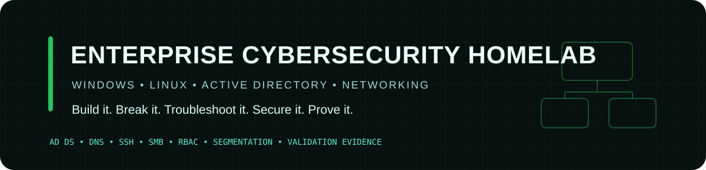

<p align="center">
  
</p>

<p align="center">
  <strong>An enterprise-style lab for hands-on infrastructure, cybersecurity, troubleshooting, and validation.</strong>
</p>

<p align="center">
  
  
  
  
</p>

---

## What this lab is

This repository documents a hands-on enterprise cybersecurity homelab designed to reinforce the skills expected in IT support, systems administration, security operations, and junior cybersecurity roles.

The goal is not simply to install virtual machines. The lab is built around **repeatable workflows, real troubleshooting, access control, evidence collection, and the ability to explain what happened and why**.

---

## Current architecture

```text
                         Internet
                            │
                 VirtualBox NAT adapters
                            │
        ┌───────────────────┴───────────────────┐
        │                                       │
      DC01                                  UBUNTU01
  Windows Server                           Ubuntu Server
  AD DS + DNS                              SSH + Linux admin
  10.10.10.10                              10.10.10.30
        │                                       │
        ├──────────── ATLASHOME-LAB ────────────┤
        │         isolated internal network      │
        │                                       │
 Win11-Client01                              Kali01
 Windows endpoint                       Security workstation
 10.10.10.20
```

### Core systems

| System | Role | Lab address |
|---|---|---:|
| **DC01** | Windows Server / Domain Controller / DNS | `10.10.10.10` |
| **Win11-Client01** | Windows domain client | `10.10.10.20` |
| **UBUNTU01** | Linux server / SSH target | `10.10.10.30` |
| **Kali01** | Security testing workstation | Lab network |
| **ATLASHOME-LAB** | Isolated VirtualBox internal network | `10.10.10.0/24` |

Domain: `atlasiqlab.local`

---

## Verified milestone

### Core network validation — 2026-08-27

The lab reached a functioning end-to-end network state with Windows and Linux systems communicating over the isolated internal network while retaining controlled outbound access.

Verified:

- Active Directory Domain Services running on DC01
- DNS, Kerberos, Netlogon, and NTDS healthy
- `atlasiqlab.local` resolves through the lab-facing domain controller
- DC01 lab interface configured at `10.10.10.10/24`
- Windows client DNS record present at `10.10.10.20`
- Ubuntu dual-NIC configuration validated
- Ubuntu reaches DC01 across the internal network
- Ubuntu retains outbound internet through NAT
- Ubuntu uses DC01 for lab DNS resolution
- OpenSSH Server enabled and listening on TCP/22
- Ubuntu package-management interruption remediated with `dpkg --configure -a`

Detailed evidence: [Core Network Validation Record](docs/core-network-validation-2026-08-27.md)

---

## Troubleshooting case study

### Multihomed domain-controller DNS issue

One of the most important failures in the build involved a domain controller with both NAT-facing and lab-facing network interfaces.

The NAT-facing address was being used in a way that interfered with domain DNS behavior.

### Remediation

- Kept the NAT interface for outbound access
- Preserved the isolated lab-facing interface for domain traffic
- Prevented the NAT-facing address from being treated as the domain DNS endpoint
- Restricted DNS service behavior to the intended lab interface
- Revalidated name resolution and internal connectivity

### Lesson

A service can be **running** and still be incorrectly bound, advertised, or routed.

That distinction matters in real troubleshooting: validate not only whether a service exists, but **which interface it is using, what address clients resolve, and what path the traffic actually takes**.

---

## Skills demonstrated

### Windows / Identity
- Active Directory Domain Services
- DNS
- Domain architecture
- Users, groups, and organizational structure
- RBAC and permission reasoning
- Windows client/server troubleshooting

### Linux
- Ubuntu Server administration
- SSH
- Package management
- Network-interface configuration
- DNS-client configuration
- Service verification

### Networking
- VirtualBox NAT
- Internal network segmentation
- Static addressing
- DNS resolution
- Endpoint-to-server connectivity
- Multi-NIC troubleshooting

### Security
- Access control
- Least-privilege thinking
- SMB/share-permission validation
- Security evidence collection
- Detection / monitoring planning
- Security workstation integration

### IT support discipline
- Problem isolation
- Layered troubleshooting
- Verification commands
- Root-cause analysis
- Remediation documentation
- Interview-ready technical explanation

---

## Evidence-driven workflow

```text
DEFINE
  ↓
INSPECT
  ↓
DECIDE
  ↓
EXECUTE
  ↓
VERIFY
  ↓
LEARN
  ↓
DOCUMENT
```

Every meaningful lab milestone should leave behind at least one of these:

- validation output
- configuration evidence
- troubleshooting record
- remediation notes
- architecture documentation
- repeatable procedure

That makes the lab useful both technically and as a portfolio artifact.

---

## Current validation targets

1. Confirm Windows client domain membership and domain-user authentication
2. Validate SMB share permissions and remove overly broad access
3. Add centralized logging and security telemetry
4. Build repeatable incident-response and detection exercises
5. Capture recruiter/interview-ready evidence for each major workflow

---

## Why this repo matters

This project is meant to answer a simple question during interviews:

> **“What have you actually built, configured, broken, fixed, and verified?”**

Instead of answering only with theory, this repository provides concrete evidence of real systems work.

The strongest outcomes from the lab are not the virtual machines themselves—they are the **troubleshooting decisions, validation evidence, access-control reasoning, and repeatable operational procedures** produced while building them.

---

## Portfolio focus

This homelab is intentionally aligned with entry-level and early-career roles across:

**IT Support • Systems Administration • SOC / Security Operations • Cybersecurity • Infrastructure Support • Junior Security Engineering**

<p align="center">
  <sub>Build it. Break it. Troubleshoot it. Secure it. Prove it.</sub>
</p>
